# (100%) 113-2 JavaScript 小考 1 -- 斷網考試

##### 2025-04-10, at E201, from 18:20~21:00

#### Note:

1. 本次小考 1 占 2 次課堂實作，斷網，有問題可以舉手提問，同學彼此不能討論
2. 請不要發揮同學愛，作弊雙方除了本次考試 0 分外，平常分數另扣 20 分，情節嚴重者會送校。
3. iClass 上請繳交 md_xx.pdf, md_quiz1.zip, quiz1_xx.zip (所有 code 壓縮檔)，壓縮前請將 md_quiz1, demo 目錄全部砍掉
4. 請直接將答案寫在 md_quiz1/md_xx.md 上，老師出題及圖片放在 md_htc.pdf 上，請依照老師所給的圖片來實作並標註
5. 跟小考相關的檔案及目錄名稱有 xx 時，必須要改成學號後 2 碼，沒有修改時，會視違犯情況扣分。
6. 每一張圖片要有機房左側背景，圖片上要有你的學號(或後兩碼)，圖片標註要跟老師所標註的類似。違者會依情節扣分。
7. 請自評分數，將每一題的 ? 填入分數，沒有填者，不會批改，以 0 分計算。

##### Your (Name, ID): (李國蘋, 213410102)

- P0 (20%): 20 分
- P1 (20%): 20 分
- P2 (20%): 20 分
- P3 (20%): 2 分
- P4 (20%): 2 分

##### 總分: 64 分

---

#### Note: 本次考試題目之路徑在 exams/quiz1_xx 下，p1_xx, p2_xx 有用到 tailwind css，p3_xx, p4_xx 使用正常的 css

### (20%) P0: 請在根目錄之 index.html，加入 Quiz1 下拉式選單，裡面有四個項目 p1_xx, p2_xx, p3_xx, p4_xx，點選後，會顯示各題之基本個人名字代號及學號資訊，Chrome 截圖要選到本次考試正確的路徑

##### => 檔案目錄，及需要修改的檔案 (xx 要改成你的學號)

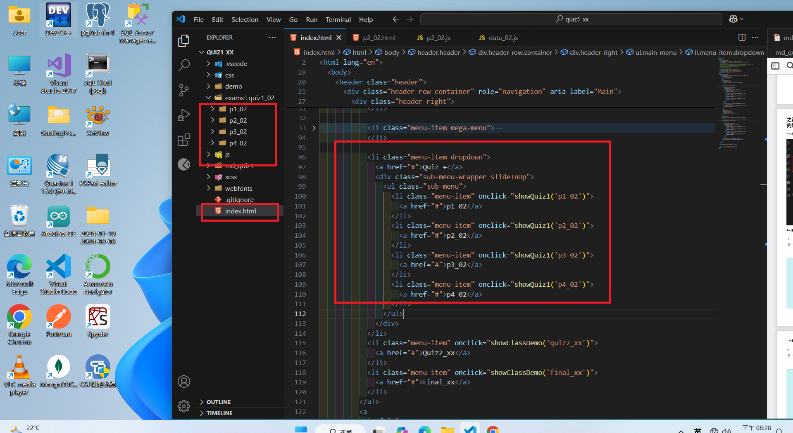

##### => 點選 p1_02 之 Chrome 顯示

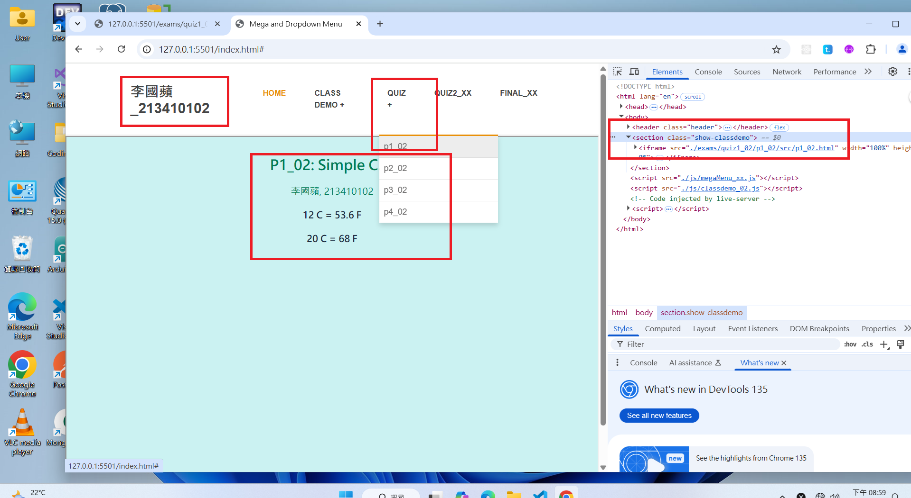

##### => 點選 p2_02 之 Chrome 顯示

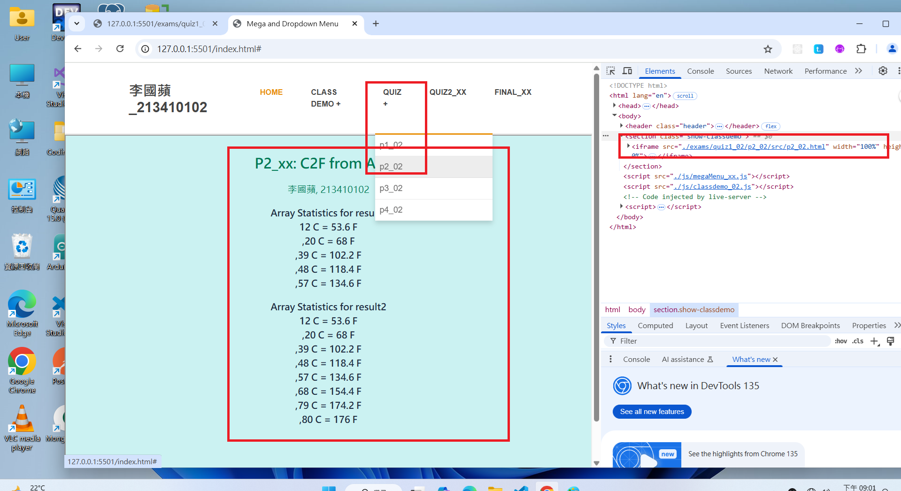

##### => 點選 p3_02 之 Chrome 顯示

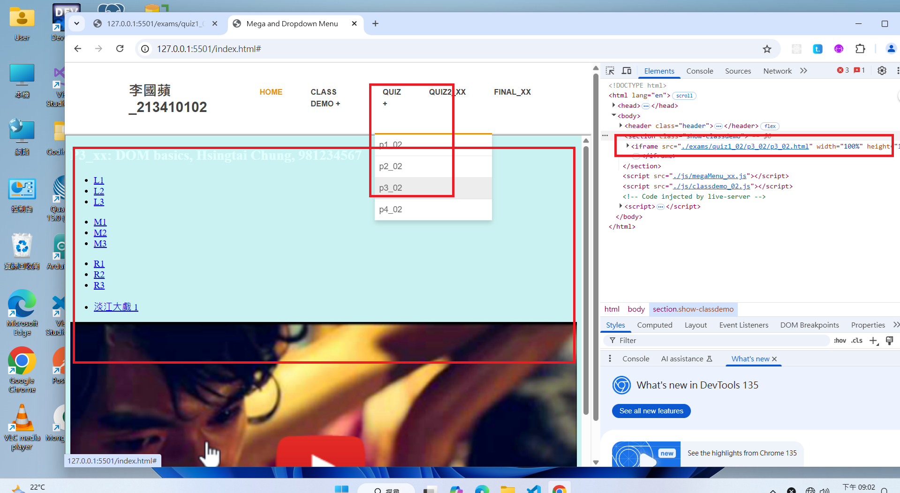

##### => 點選 p4_02 之 Chrome 顯示

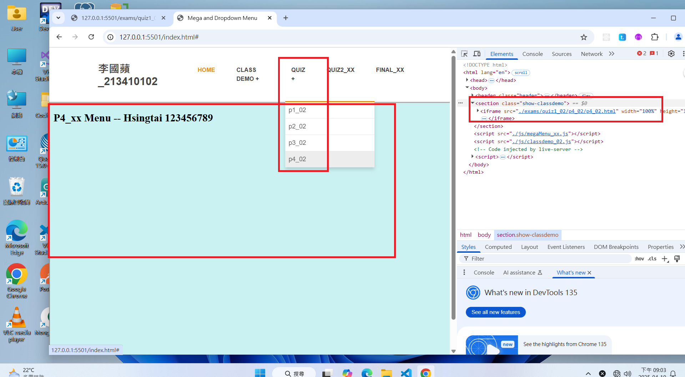

#### Your Answ02

##### => 檔案目錄，及需要修改的檔案 (xx 要改成你的學號)


##### => 點選 02_xx 之 Chrome 顯示


##### =02點選 p2_xx 之 Chrome 顯示


##### =02點選 p3_xx 之 Chrome 顯示


##### =>02選 p4_xx 之 Chrome 顯示


##### => classdemo_xx.js code 修改重點

本題需02叫 showQuiz1(item)，傳進的 item 是'p1_xx' ~ 'p4_xx'

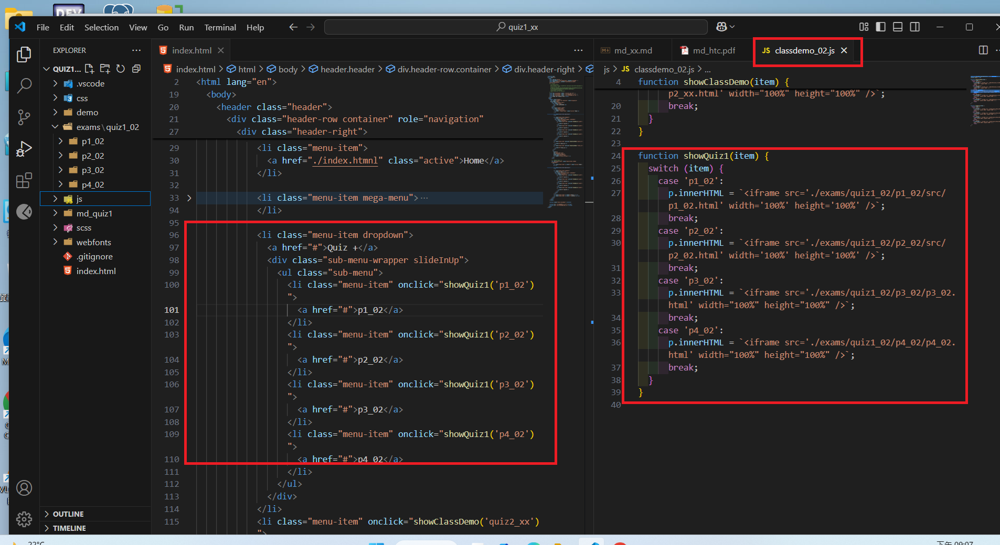

---

### (20%) P1: 實作 p1_xx

以你學號後兩碼，取兩個攝氏溫度，本次考試老師用的學號後兩碼是 89，因此取 19, 28 兩個溫度，第 1 個數字 10~19, 第 2 個數字 20~29。

請將第 1 個數字的結果放入 result1 選擇器中，第 2 個數字的結果放入 result2 選擇器中，格式如下

```
19°C = 66.2°F
```

tailwindcss watch 指令如下，請記得要先切換到 p1_xx 目錄下，再執行

```
npx @tailwindcss/cli -i ./src/input.css -o ./src/output.css --watch
```

#####02> 檔案目錄 (xx 要改成你的學號)

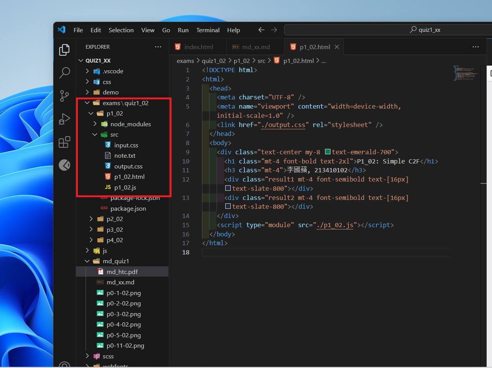

#####02> Chrome 顯示

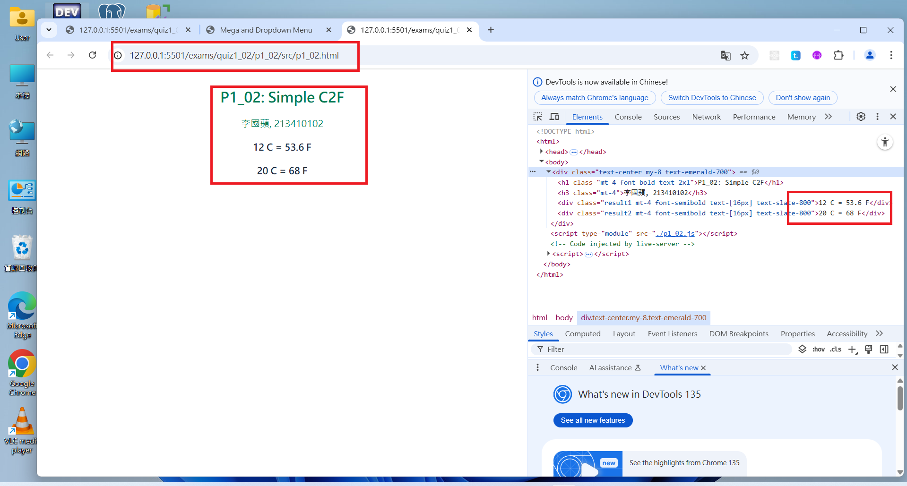

#### Your Answer

#####02> 檔案目錄 (xx 要改成你的學號)


#####02> Chrome 顯示


#####02> p1_xx.js 重點截圖

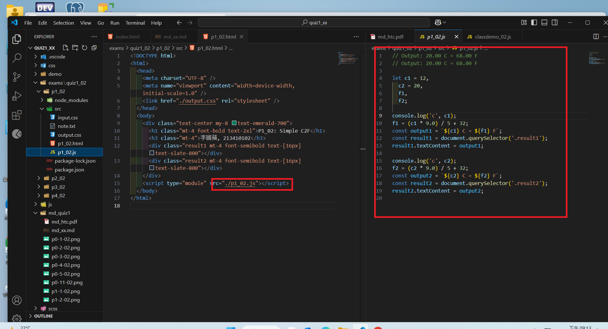

---

### (20%) P2: 實作 p2_xx

以你學號後 5 碼，取 5 個攝氏溫度，放入 data_xx.js 之 data1 中。本次考試老師用的學號後 5 碼是 56789，因此取 19, 28, 37, 46, 55。

讀入 data1 陣列中的數字讀入，計算其華氏溫度，將 5 筆資料之結果放入 result1 選擇器中，
之後根據你的學號，再讀入 3 個數字， 本例是 234，因此取 64, 73, 82 三個數字，將 8 個數字的結果放入 result2 選擇器中，輸出格式同 P1

```
19°C = 66.2°F
```

tailwindcss watch 指令如下，請記得要先切換到 p2_xx 目錄下，再執行

```
npx @tailwindcss/cli -i ./src/input.css -o ./src/output.css --watch
```

#####02> 檔案目錄 (xx 要改成你的學號)

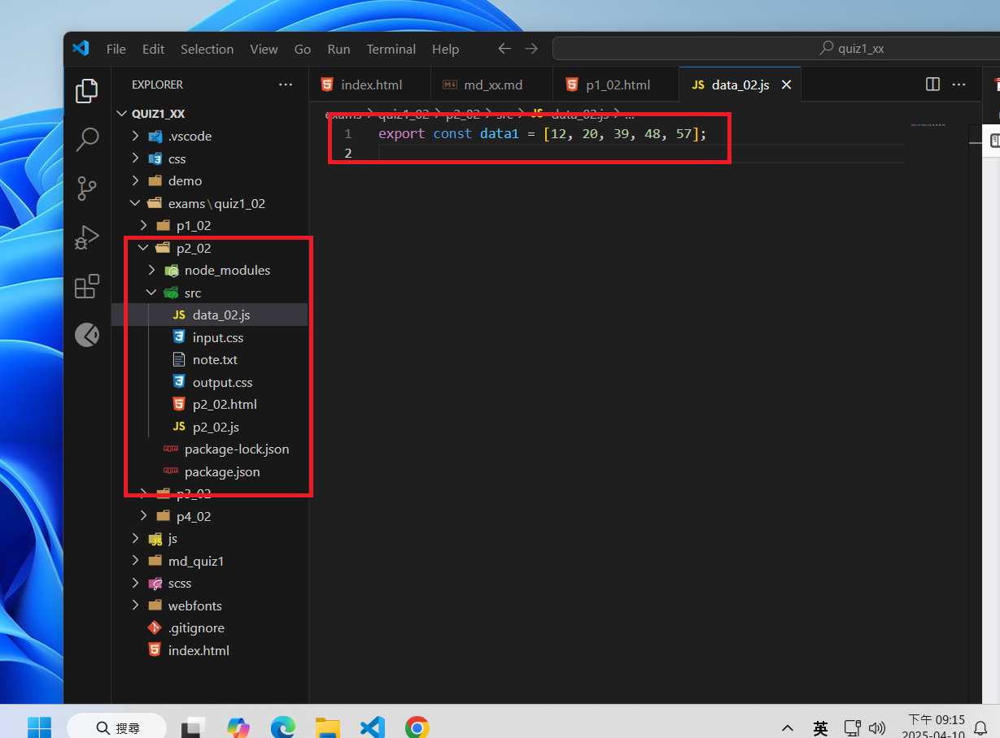

##### =02Chrome 顯示

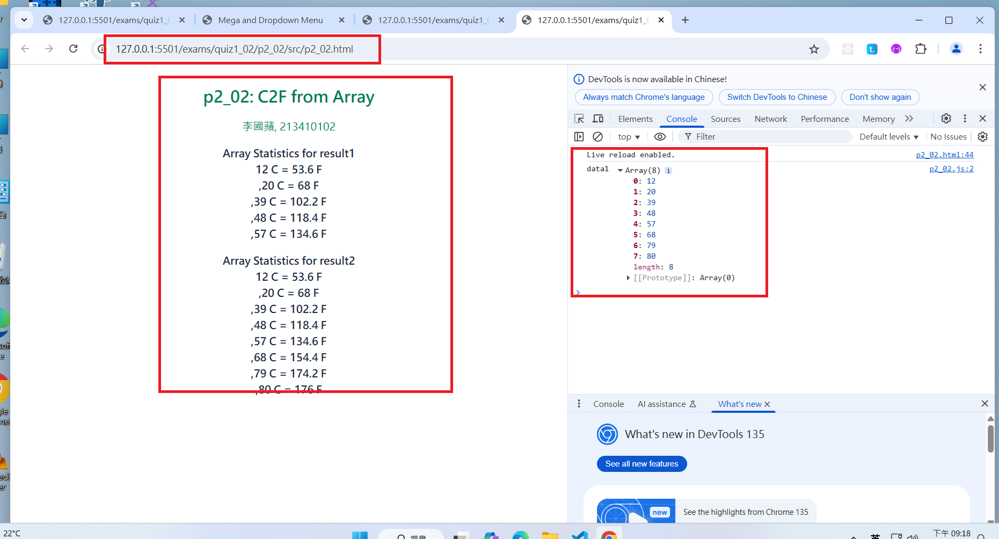

#### Your Answer

##### =02檔案目錄 (xx 要改成你的學號)


##### =02Chrome 顯示


##### =02p1_xx.js 重點截圖

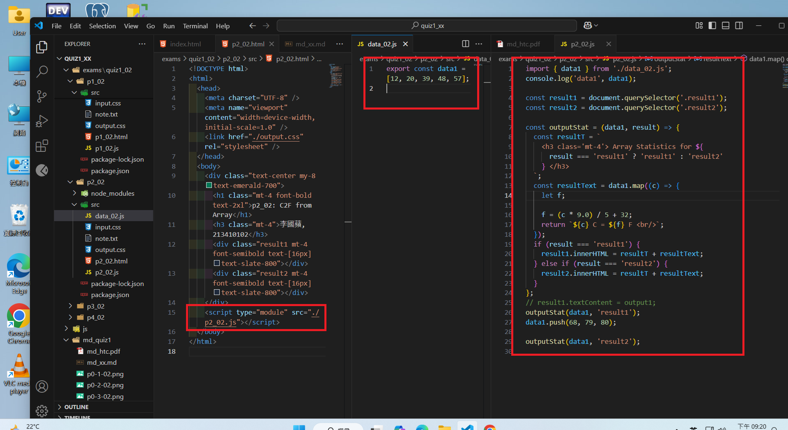

---

### (20%) P3: 實作 p3_xx

##### => 檔案目錄


##### =02Chrome: 一開始，只有顯示"淡江大戲 1"，圖片是淡江大戲 1 的圖片

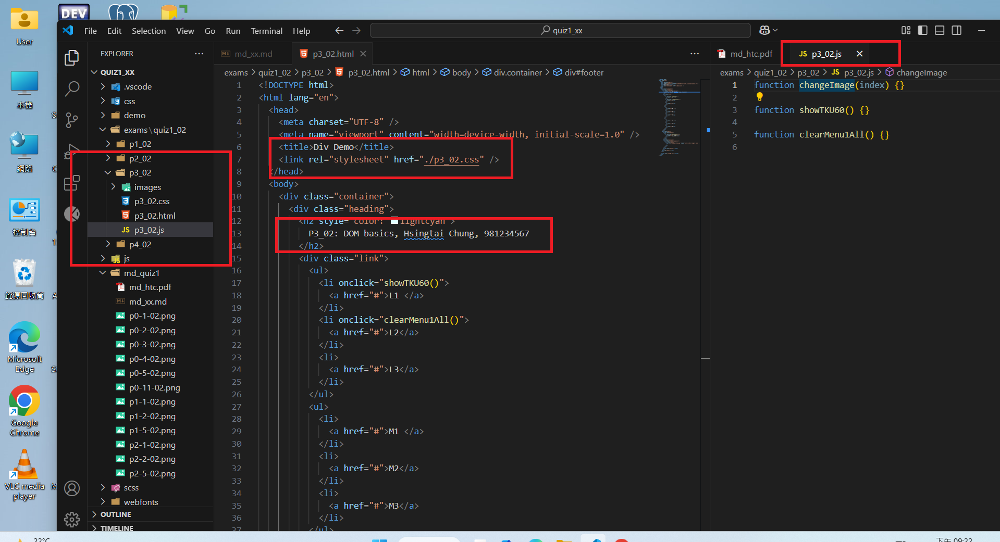

##### => Chrome: 點選 L1 按鈕，顯示"淡江大戲 1" ~ "淡江大戲 5"，點選"淡江大戲 1"，要能顯示淡江大023 的圖片

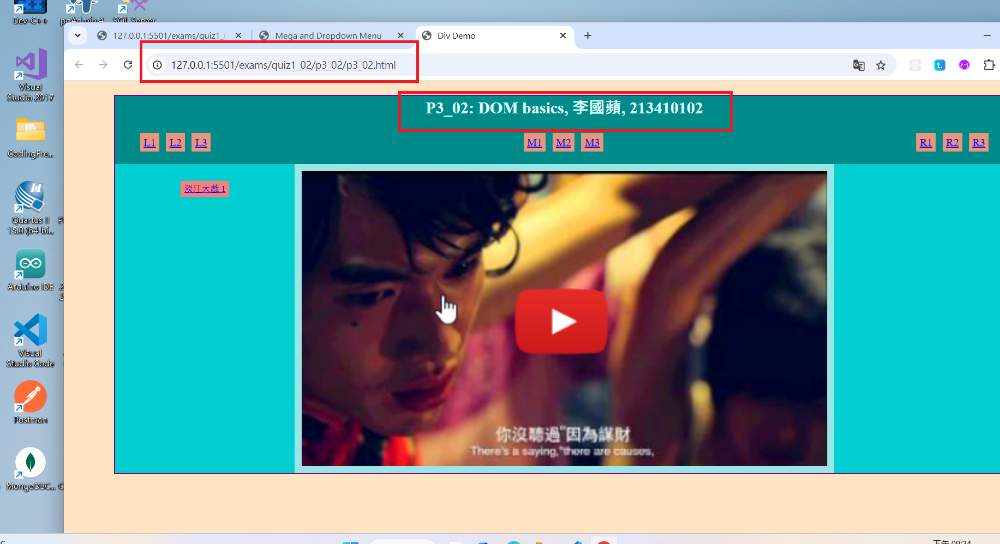

##### => Chrome: 點選 L2 按鈕，清除所有"淡江大戲 1" ~ "淡江大戲 5"，顯示"淡江大戲 1"的02


#### Your Answer

####02=> 檔案目錄 (xx 要改成你的學號)


####02=> Chrome: 一開始，只有顯示"淡江大戲 1"，圖片是淡江大戲 1 的圖片


##### => Chrome: 點選 L1 按鈕，顯示"淡江大戲 1" ~ "淡江大戲 5"，點選"淡江大戲 1"，要02示淡江大戲 3 的圖片


##### => Chrome: 點選 L2 按鈕，清除所有"淡江大戲 1" ~ "淡江大戲 5"，顯示"淡江大戲 102圖片


### => p3_xx.js 三個需實作的 function code (可以多張圖片)


---

### (20%) P4: 實作 p4_xx

提供 menu theme，可以參考其顯示畫面

##### => 檔案目錄

p4_xx.html 中的 class 名稱 btn-center, menu-center 請不要更改，其內容一開始是空的，需要考 JavaScript 將資料放入。

```
    <section class="menu">
      <!-- title -->
      <div class="title">
        <h2>P4_xx Menu -- Hsingtai 123456789</h2>
        <div class="underline"></div>
      </div>
      <!-- filter buttons -->
      <div class="btn-center"></div>
      <!-- menu items -->
      <div class="menu-center"></div>
    </section>
    <script type="module" src="./p4_xx.js"></script>
  </body>
```

data_xx.js 中提供的陣列，名稱是 memu_xx 請將 xx 改成你的學號後兩碼，匯入 p4_xx.js 中時，用的陣列名稱是 menu_xx

如果沒有遵守上述規定，會給予扣分 10~20 分。

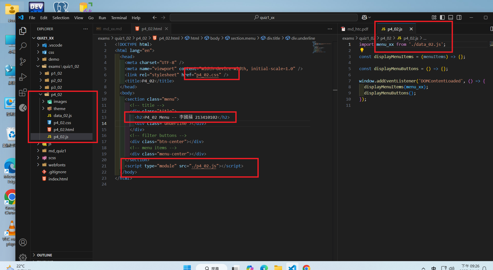

##### => Chrome 顯示

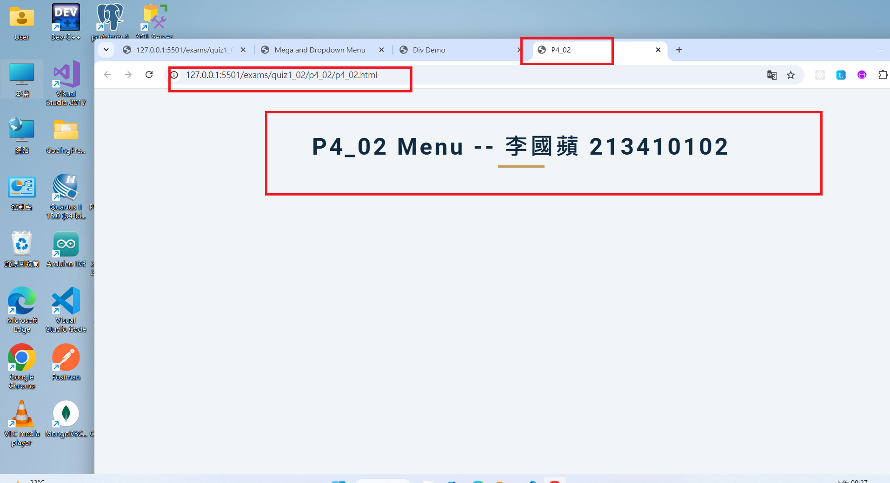

#### Your Answer

##### => 檔案目錄 (xx 要改成你的學號)


##### => Chrome 顯示


##### => p4_xx.js code，標註重點如何將內容放入 menu-center 中 (可以多張圖)


##### => p4_xx.js code，標註重點如何將內容放入 btn-center 中


---
